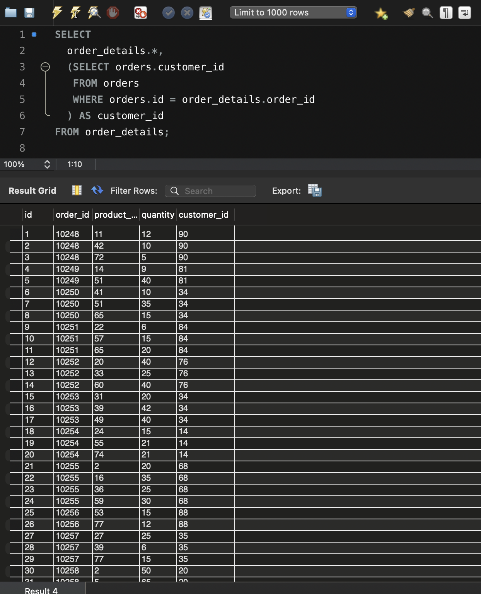
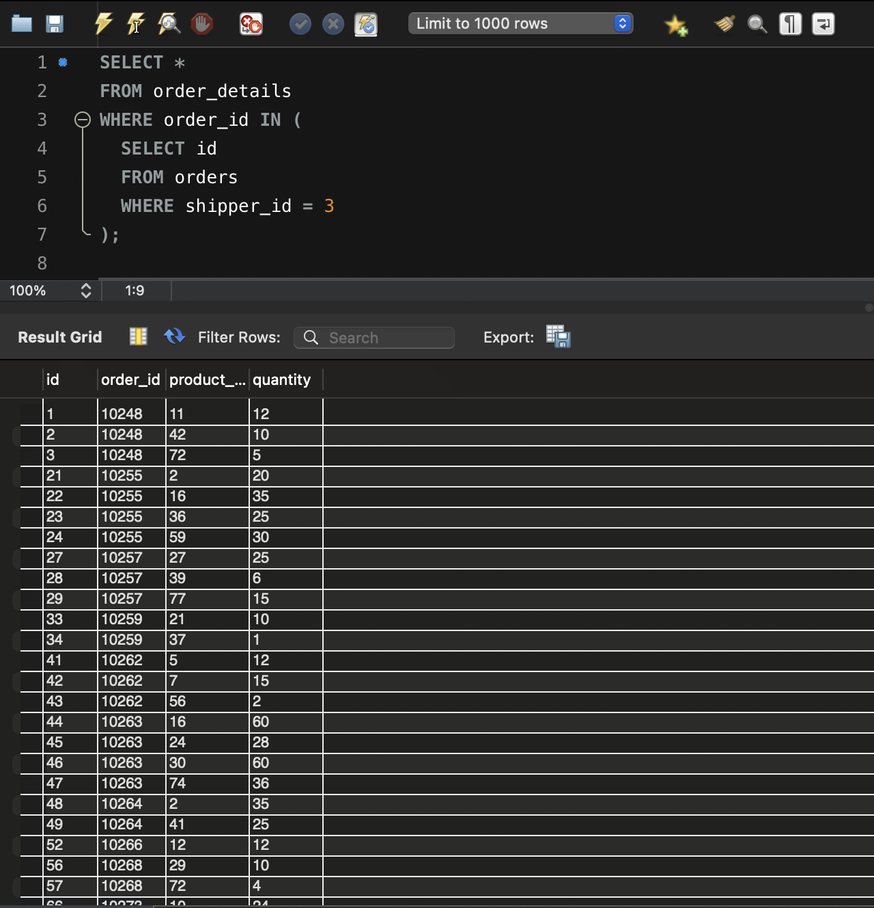
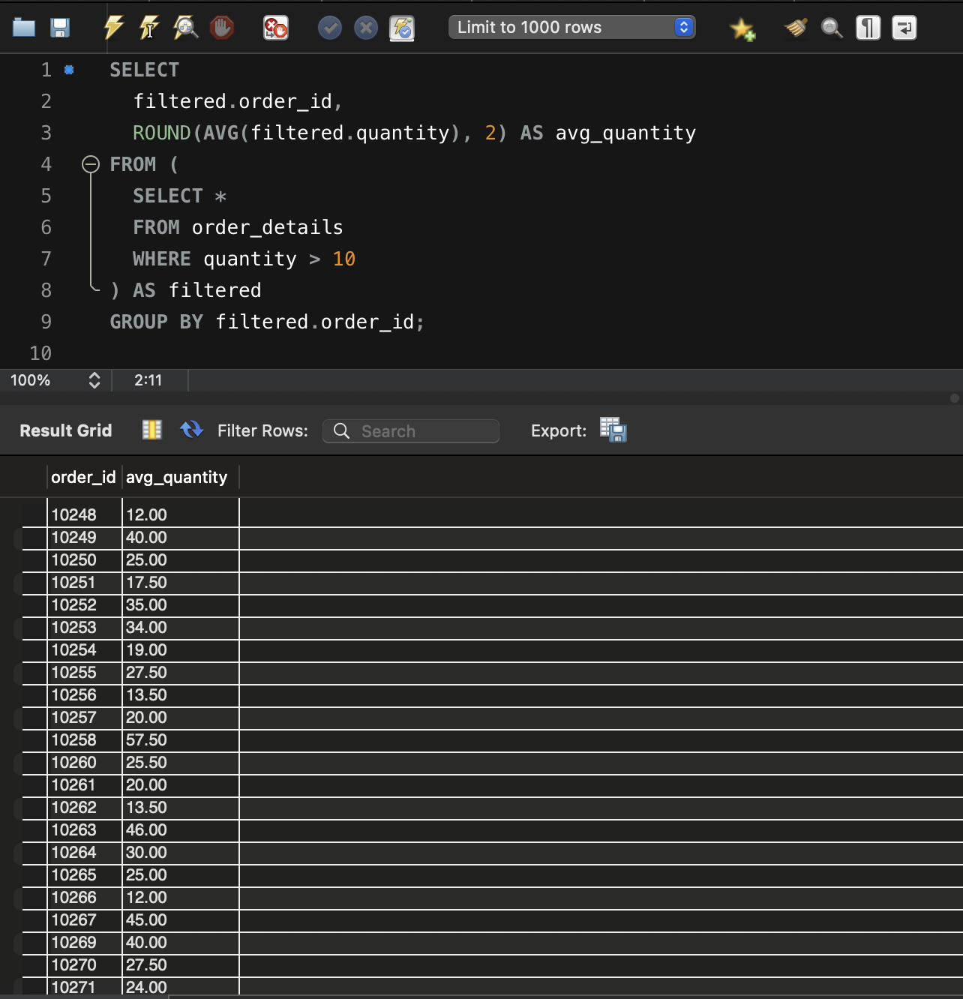
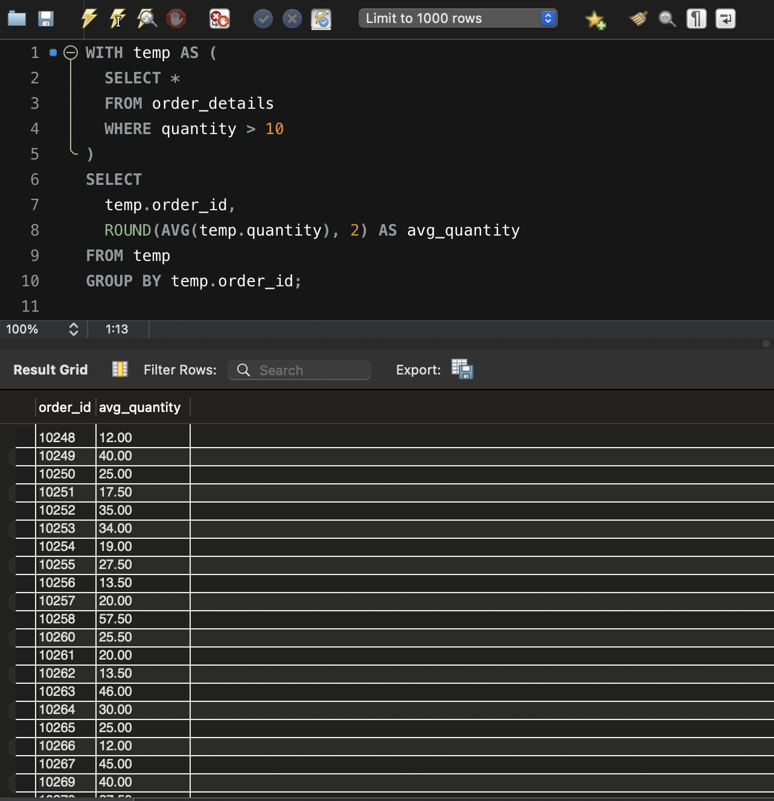
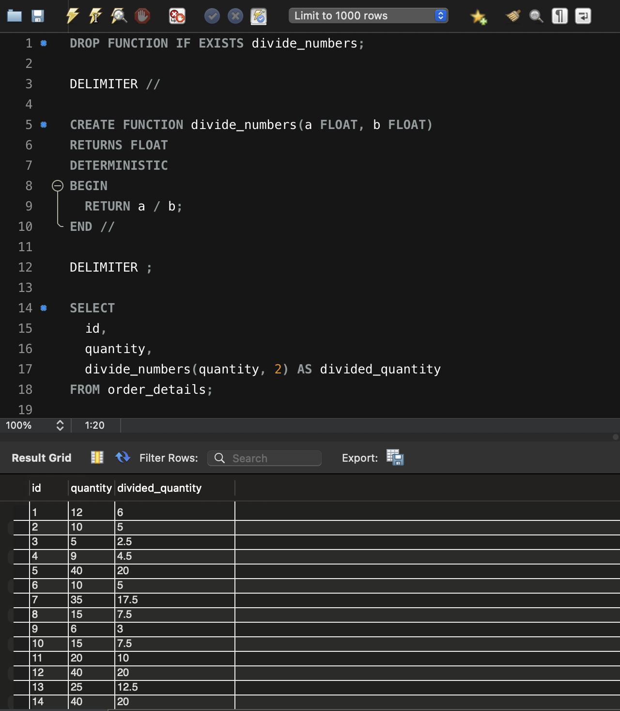

# 🧩 Домашнє завдання до Теми 5. Вкладені запити. Повторне використання коду

Цей репозиторій містить виконане практичне завдання до теми №5 з курсу **Реляційні бази даних**.  
Завдання присвячене роботі з вкладеними запитами (`subquery`), створенням тимчасових таблиць (`WITH`) та написанням власних SQL-функцій.

---

## 📚 Зміст

1. [🔍 Вкладений запит у SELECT](#1-вкладений-запит-у-select)
2. [🗂️ Вкладений запит у WHERE](#2-вкладений-запит-у-where)
3. [🔄 Вкладений запит у FROM](#3-вкладений-запит-у-from)
4. [📦 Створення CTE через WITH](#4-cte-через-with)
5. [🧮 Створення функції та її використання](#5-створення-функції-та-використання)
6. [✅ Висновок](#висновок)

---

## 1. Вкладений запит у SELECT

```sql
SELECT
  order_details.*,
  (SELECT orders.customer_id
   FROM orders
   WHERE orders.id = order_details.order_id
  ) AS customer_id
FROM order_details;
```

🖼️ 

---

## 2. Вкладений запит у WHERE

```sql
SELECT *
FROM order_details
WHERE order_id IN (
  SELECT id
  FROM orders
  WHERE shipper_id = 3
);
```

🖼️ 

---

## 3. Вкладений запит у FROM

```sql
SELECT
  filtered.order_id,
  ROUND(AVG(filtered.quantity), 2) AS avg_quantity
FROM (
  SELECT *
  FROM order_details
  WHERE quantity > 10
) AS filtered
GROUP BY filtered.order_id;
```

🖼️ 

---

## 4. CTE через WITH

```sql
WITH temp AS (
  SELECT *
  FROM order_details
  WHERE quantity > 10
)
SELECT
  temp.order_id,
  ROUND(AVG(temp.quantity), 2) AS avg_quantity
FROM temp
GROUP BY temp.order_id;
```

🖼️ 

---

## 5. Створення функції та використання

```sql
DROP FUNCTION IF EXISTS divide_numbers;

DELIMITER //

CREATE FUNCTION divide_numbers(a FLOAT, b FLOAT)
RETURNS FLOAT
DETERMINISTIC
BEGIN
  RETURN a / b;
END //

DELIMITER ;

SELECT
  id,
  quantity,
  divide_numbers(quantity, 2) AS divided_quantity
FROM order_details;
```

🖼️ 

---

## ✅ Висновок

📌 У цьому завданні:

- Реалізовано роботу з різними видами вкладених запитів
- Використано оператор `WITH` для покращення читабельності коду
- Створено власну функцію в MySQL для обчислень
- Забезпечено наочну структуру запитів для перевірки

> ✍️ _Скріншоти результатів додаються до кожного запиту для візуального підтвердження._
